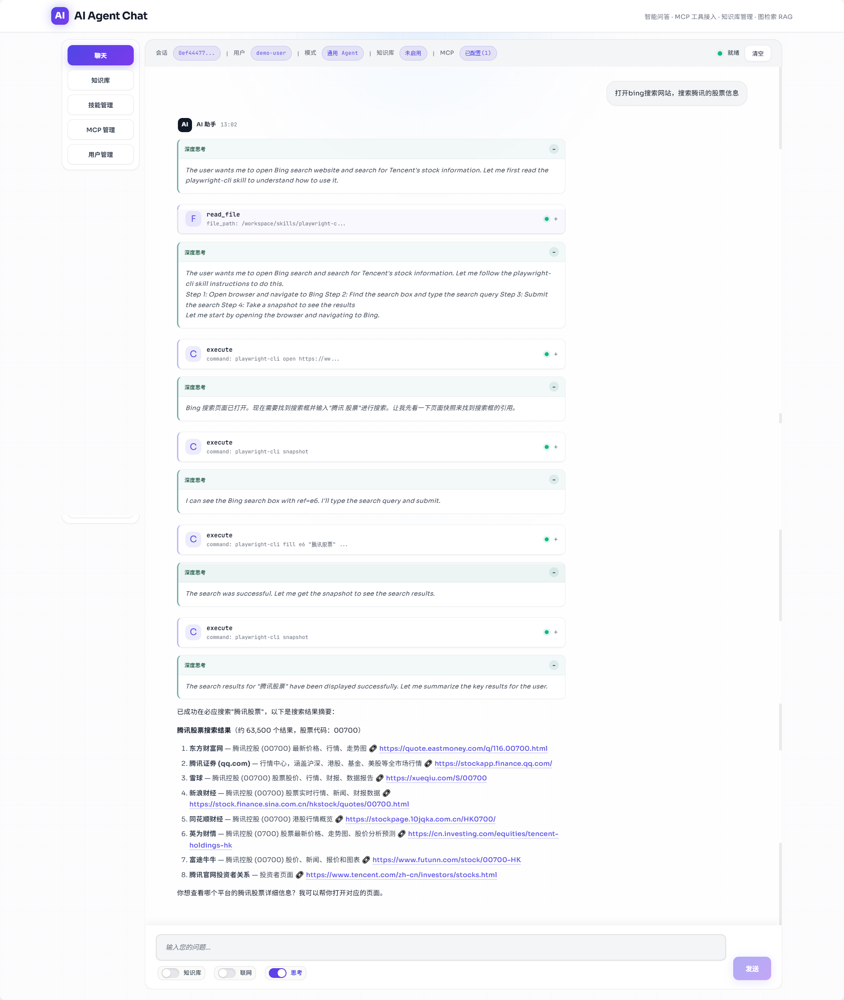
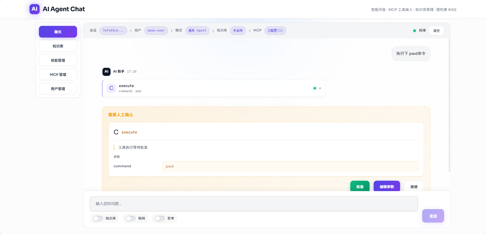
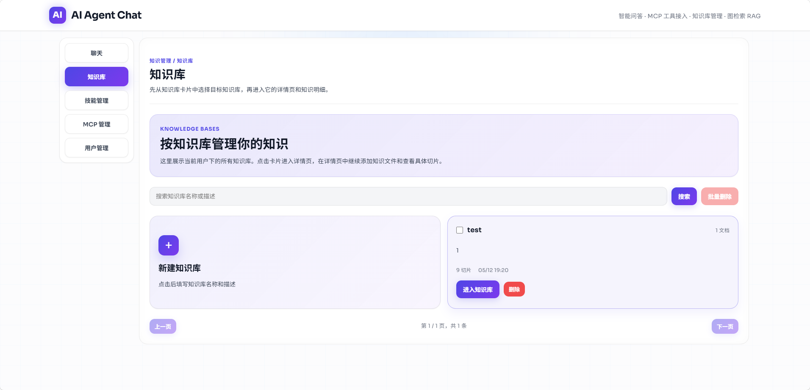
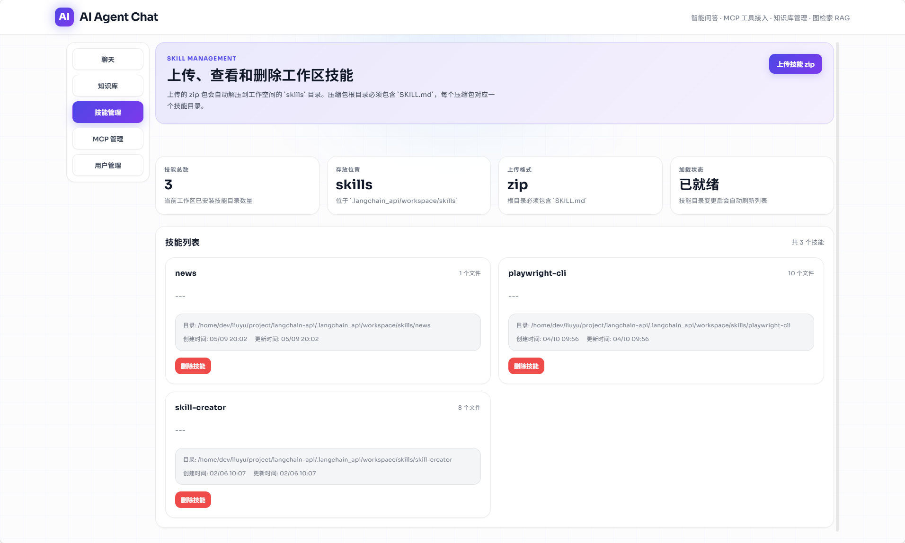
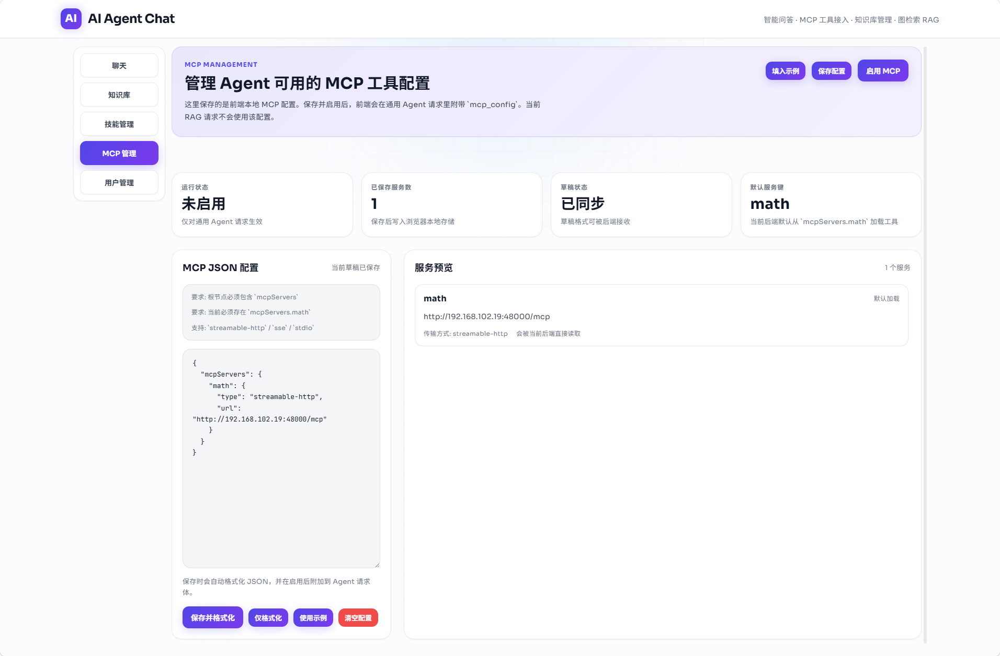
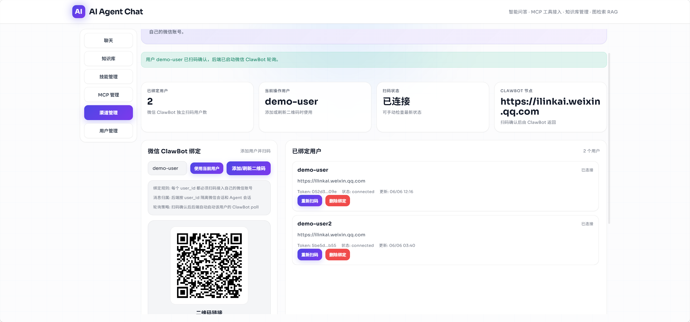
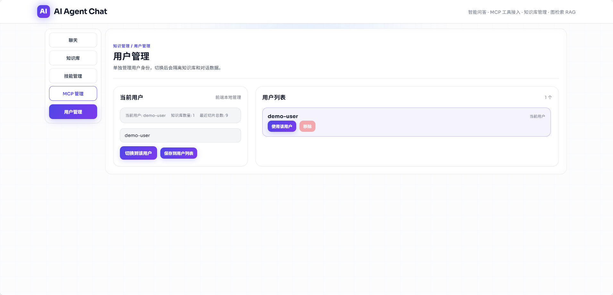

<h1 align="center">DeepClaw</h1>

<p align="center">
  <a href="#"></a>
  <a href="#"></a>
  <a href="#"></a>
  <a href="#"></a>
  <a href="#"></a>
  <a href="#"></a>
</p>

<p align="center">
  <a href="#快速开始">快速开始</a>
  ·
  <a href="#核心能力">核心能力</a>
  ·
  <a href="#界面预览">界面预览</a>
  ·
  <a href="#api-接口">API 接口</a>
  ·
  <a href="#配置说明">配置说明</a>
  ·
  <a href="#项目结构">项目结构</a>
</p>

DeepClaw 是一个面向二次开发的智能体服务。项目把通用 Agent、RAG 知识库、技能管理、渠道接入、MCP 配置和静态前端整合到同一个 FastAPI 服务中，适合快速搭建企业知识问答、自动化助手、内部 Copilot 和多工具智能体应用。

## 核心能力

| 能力 | 说明 |
|------|------|
| 通用 Agent | 基于 LangGraph / DeepAgents 构建，支持工具调用、SSE 流式输出、MCP 配置透传 |
| RAG 知识库 | 支持知识库创建、文档上传、切片查看、图检索 RAG 和独立 RAG 问答 |
| 多模态输入 | 通用接口 `query` 支持纯文本与图文混合结构 |
| 技能管理 | 支持技能列表、上传和删除 |
| 渠道接入 | 内置飞书、钉钉、微信 ClawBot 路由和会话管理 |
| 多执行后端 | 支持 `local_shell`、`store`、`sandbox` 三种执行模式 |
| 前端界面 | Next.js + React 聊天 UI，构建后由 FastAPI 的 `/` 统一托管 |
| 可观测性 | 可选接入 Phoenix tracing、Postgres 长期记忆和 Tavily 搜索 |

## 界面预览

以下界面覆盖项目当前的主要工作流，包括聊天、人工确认、知识库、技能管理、MCP 管理、渠道管理和用户隔离。

### 聊天主界面



统一承载 Agent 对话、工具调用流式输出和核心交互入口。

### Human in the Loop 人工确认



展示工具调用进入人工确认后的审批与参数编辑流程。

### 知识库管理



用于查看知识库列表、知识详情、文档分页和切片明细。

### 技能管理



用于上传、删除和维护工作区技能目录。

### MCP 管理



用于维护 MCP 配置，并控制通用 Agent 请求是否附带 MCP 服务定义。

### 渠道管理



用于管理飞书、钉钉、微信 ClawBot 渠道接入、用户绑定和会话回复模式。

### 用户管理



用于切换和维护不同用户身份，隔离对话、知识库和渠道数据。

## 技术栈

| 模块 | 技术 |
|------|------|
| 后端 | FastAPI, LangGraph, DeepAgents, LangChain |
| RAG | Elasticsearch, Dense Vector, BM25, Graph RAG |
| 前端 | Next.js 15, React 19, TypeScript |
| 执行后端 | Local Shell, Store Backend, OpenSandbox |
| 可选组件 | Phoenix, Tavily, PostgresStore |
| 包管理 | uv, pnpm |

## 项目结构

```text
deepclaw/
├── deepclaw/
│   ├── agents/              # 通用 Agent / RAG Agent 组装、上下文与状态
│   ├── backend/             # 执行后端相关实现
│   ├── common/              # Elasticsearch、Graph RAG、文本切分等通用实现
│   ├── middleware/          # 业务开关、RAG 注入、MCP、工具搜索等中间件
│   ├── patch/               # 第三方库补丁与适配
│   ├── tools/               # 天气、网页抓取、检索、定时任务等工具
│   ├── web_backend/         # FastAPI Web 应用层与所有 Web 功能目录
│   ├── main.py              # 主启动入口
│   └── settings.py          # 环境变量配置
├── frontend/                # Next.js 前端
├── .deepclaw/               # 运行时工作区、技能目录、渠道数据库等
├── assets/                  # 截图和 Elasticsearch 插件
└── docker-compose.yml       # PostgreSQL / Elasticsearch / Phoenix
```

## 快速开始

### 1. 环境要求

| 场景 | 依赖 |
|------|------|
| 仅运行后端和已构建前端 | Python `>= 3.12`、`uv`、Docker / Docker Compose |
| 开发或重新构建前端 | 额外需要 Node.js `>= 18`、`pnpm` |

如果仓库里的 `frontend/out` 已经存在，且你不修改前端代码，可以直接跳过前端安装和构建步骤。

### 2. 启动依赖服务

```bash
docker-compose up -d postgresql elasticsearch
```

如需 Phoenix 观测：

```bash
docker-compose up -d phoenix
```

Phoenix 控制台默认地址：`http://localhost:6006`

### 3. 初始化后端

```bash
cp .env.example .env
uv sync --dev
```

如果要启用 OpenSandbox：

```bash
uv sync --dev --extra opensandbox
```

### 4. 配置 `.env`

至少填入：

```dotenv
OPENAI_API_KEY=your-api-key
OPENAI_API_BASE=http://localhost:8082/v1
CHAT_MODEL_NAME=qwen3
EMBEDDING_MODEL_NAME=qwen3-embedding
ES_URL=http://localhost:9200
ES_URSR=elastic
ES_PWD=elastic@2024
```

### 5. 启动主服务

统一从 `main` 入口启动：

```bash
uv run python -m deepclaw.main
```

服务启动后：

- 前端页面：`http://localhost:7869/`
- Agent SSE：`POST /api/agent/general_api`
- Agent AG-UI：`POST /api/agent/ag_ui`
- RAG SSE：`POST /api/rag/general_api`
- Channels API：`/api/channels/*`

### 6. 前端开发

仅在你需要开发或重新构建前端时执行：

```bash
cd frontend
pnpm install
pnpm dev
```

开发模式地址：`http://localhost:3000`

构建静态前端并交给后端托管：

```bash
cd frontend
pnpm build
```

## API 接口

### Agent

| 方法 | 路径 | 协议 | 用途 |
|------|------|------|------|
| `POST` | `/api/agent/ag_ui` | AG-UI | Agent 前端协议接口 |
| `POST` | `/api/agent/general_api` | SSE | 通用 Agent 流式接口 |
| `POST` | `/api/agent/skills/list` | REST | 技能列表 |
| `POST` | `/api/agent/skills/upload` | REST | 上传技能 zip |
| `POST` | `/api/agent/skills/delete` | REST | 删除技能 |

### RAG

| 方法 | 路径 | 协议 | 用途 |
|------|------|------|------|
| `POST` | `/api/rag/general_api` | SSE | RAG 流式问答 |
| `POST` | `/api/rag/knowledge-bases/list` | REST | 知识库分页列表 |
| `POST` | `/api/rag/knowledge-bases/create` | REST | 创建知识库 |
| `POST` | `/api/rag/knowledge-bases/detail` | REST | 知识库详情 |
| `POST` | `/api/rag/knowledge-bases/update` | REST | 更新知识库 |
| `POST` | `/api/rag/knowledge-bases/delete` | REST | 删除知识库 |
| `POST` | `/api/rag/knowledge-bases/bulk-delete` | REST | 批量删除知识库 |
| `POST` | `/api/rag/knowledge-bases/documents/list` | REST | 文档分页列表 |
| `POST` | `/api/rag/knowledge-bases/documents/detail` | REST | 文档切片详情 |
| `POST` | `/api/rag/knowledge-bases/documents/upload` | REST | 上传文档 |
| `POST` | `/api/rag/knowledge-bases/documents/update` | REST | 更新文档展示名 |
| `POST` | `/api/rag/knowledge-bases/documents/delete` | REST | 删除文档 |
| `POST` | `/api/rag/knowledge-bases/documents/bulk-delete` | REST | 批量删除文档 |

### Channels

| 方法 | 路径 | 协议 | 用途 |
|------|------|------|------|
| `POST` | `/api/channels/feishu/events` | REST | 飞书事件入口 |
| `POST` | `/api/channels/dingtalk/events` | REST | 钉钉事件入口 |
| `POST` | `/api/channels/weixin-clawbot/qrcode` | REST | 获取微信 ClawBot 登录二维码 |
| `GET` | `/api/channels/weixin-clawbot/qrcode/status` | REST | 查询二维码状态 |
| `POST` | `/api/channels/weixin-clawbot/users/{user_id}/qrcode` | REST | 生成用户绑定二维码 |
| `GET` | `/api/channels/weixin-clawbot/users` | REST | 列出已绑定用户 |
| `DELETE` | `/api/channels/weixin-clawbot/users/{user_id}` | REST | 删除绑定 |
| `GET` | `/api/channels/sessions` | REST | 列出渠道会话 |
| `PATCH` | `/api/channels/sessions/{session_id}` | REST | 更新会话回复模式 |

## 使用示例

### 通用 Agent 问答

```bash
curl -N -X POST http://localhost:7869/api/agent/general_api \
  -H "Content-Type: application/json" \
  -d '{
    "query": "帮我总结一下今天的工作安排",
    "session_id": "demo-session",
    "user_id": "demo-user",
    "internet_search": false,
    "deep_thinking": false
  }'
```

### 多模态 Agent 输入

```bash
curl -N -X POST http://localhost:7869/api/agent/general_api \
  -H "Content-Type: application/json" \
  -d '{
    "query": [
      { "type": "text", "text": "这张图片里有什么？" },
      {
        "type": "image",
        "url": "https://example.com/demo.jpg",
        "mime_type": "image/jpeg"
      }
    ],
    "session_id": "multi-modal-session",
    "user_id": "demo-user"
  }'
```

### 创建知识库

```bash
curl -X POST http://localhost:7869/api/rag/knowledge-bases/create \
  -H "Content-Type: application/json" \
  -d '{
    "user_id": "demo-user",
    "name": "产品文档",
    "description": "示例知识库"
  }'
```

### 上传文档

```bash
curl -X POST http://localhost:7869/api/rag/knowledge-bases/documents/upload \
  -F "user_id=demo-user" \
  -F "knowledge_base_id=<knowledge_base_id>" \
  -F "files=@./demo.pdf"
```

### 调用 RAG 流式问答

`index_name` 和 `graph_name` 可从知识库详情返回值中的 `passage_index`、`index_prefix` 获取。

```bash
curl -N -X POST http://localhost:7869/api/rag/general_api \
  -H "Content-Type: application/json" \
  -d '{
    "query": "这份文档的核心结论是什么？",
    "session_id": "rag-session",
    "user_id": "demo-user",
    "index_name": "kb_xxx_passages",
    "graph_name": "kb_xxx"
  }'
```

## 配置说明

### 必填环境变量

| 变量 | 说明 |
|------|------|
| `OPENAI_API_BASE` | OpenAI-compatible LLM API 地址 |
| `OPENAI_API_KEY` | LLM API 密钥 |
| `CHAT_MODEL_NAME` | 聊天模型名称 |
| `EMBEDDING_MODEL_NAME` | 向量模型名称 |
| `ES_URL` | Elasticsearch 地址 |
| `ES_URSR` | Elasticsearch 用户名 |
| `ES_PWD` | Elasticsearch 密码 |

### 常用可选环境变量

| 变量 | 说明 |
|------|------|
| `BACKEND_TYPE` | 执行后端：`local_shell` / `store` / `sandbox` |
| `PG_DATABASE_URL` | 启用 PostgresStore 长期记忆 |
| `TAVILY_API_KEY` | 启用联网搜索工具 |
| `USE_TOOL_SEARCH` | 启用延迟工具搜索 |
| `USE_COPILOTKIT` | 启用 CopilotKit 中间件 |
| `PHOENIX_COLLECTOR_ENDPOINT` | 启用 Phoenix tracing |
| `AUTH_ADMIN_EMAIL` | 默认管理员邮箱 |
| `AUTH_ADMIN_PASSWORD` | 默认管理员密码 |
| `AUTH_TOKEN_EXPIRE_DAYS` | 登录态有效期天数 |
| `CHANNEL_AGENT_API_URL` | 渠道网关调用 Agent 的地址 |
| `WEIXIN_CLAWBOT_*` | 微信 ClawBot 相关配置 |

## 常见说明

- 后端会直接挂载 `frontend/out`。如果该目录已经存在，纯运行场景不需要安装 Node.js 和 pnpm。
- 前端修改后，必须重新执行 `pnpm build`，后端 `/` 才会提供最新页面。
- 默认工作区位于 `.deepclaw/workspace`。
- 渠道模块默认把 SQLite 数据库写入 `.deepclaw/channels.db`。
- 如果 `frontend/out` 不存在，后端仍可提供 API，但 `/` 不会挂载前端页面。

## License

Apache-2.0
